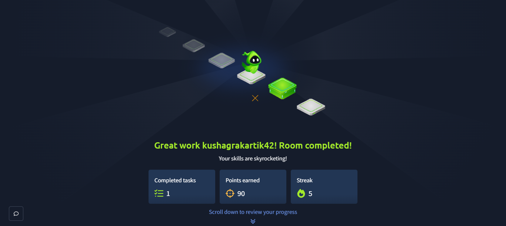

# Pickle Rick - TryHackMe

## About

This was a beginner CTF room on TryHackMe. The main goal was to find the three ingredients.

## Tools Used

- Nmap
- Gobuster
- Linux commands
- Web browser

## What I Did

I started by scanning the machine with Nmap to check the open ports and services.

After that, I opened the website and checked the page and source code for useful information.

I then searched for hidden files and directories on the web server. I found some useful files that helped me move forward.

After finding the login information, I accessed the portal and found a command panel.

I used the command panel to run Linux commands and searched through the files for the ingredients.

Finally, I found all three ingredients and completed the room.

## What I Learned

- Basic Nmap scanning
- Web enumeration
- Finding hidden files
- Basic Linux commands
- Basic privilege escalation
- How a CTF machine can be approached step by step

## Proof

Room completed on TryHackMe.

## Room

[TryHackMe - Pickle Rick](https://tryhackme.com/room/picklerick)
