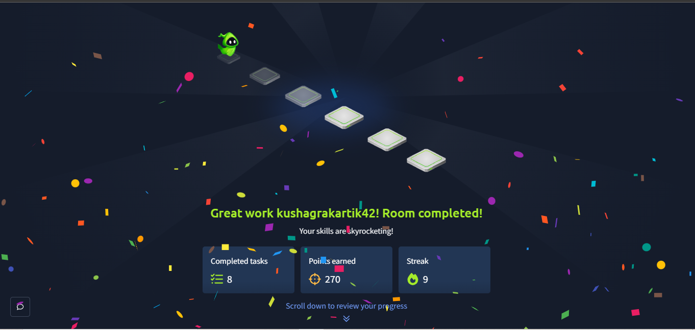

# 🔐 TryHackMe — Reversing ELF

**Category:** Reverse Engineering  
**Challenges:** Crackme1 → Crackme8  
**Status:** ✅ Completed

## 🛠️ Tools
- TryHackMe AttackBox
- Linux
- GDB
- strings
- file
- ltrace

## 🔎 Challenges

### Crackme1
- Identified the ELF binary using `file`
- Used `strings` to inspect readable data
- Used GDB to understand `main`
- **Key concept:** Basic ELF analysis

### Crackme2
- Found the password check using `strcmp`
- Inspected the referenced string with GDB
- Analyzed `giveFlag()`
- **Key concept:** Runtime flag generation

### Crackme3
- Found a suspicious Base64 string
- Decoded it using `base64 -d`
- **Key concept:** Base64 encoding

### Crackme4
- Analyzed `get_pwd()`
- Found an XOR transformation
- **Key concept:** XOR-based obfuscation

### Crackme5
- Analyzed the custom comparison function
- Followed the XOR-based validation
- **Key concept:** Custom input validation

### Crackme6
- Traced character-by-character password checks
- Reconstructed the expected input
- **Key concept:** Conditional checks

### Crackme7
- Followed the program's control flow
- Found the condition leading to `giveFlag()`
- **Key concept:** Control-flow analysis

### Crackme8
- Analyzed `giveFlag()`
- Followed the byte transformation
- **Key concept:** Runtime data manipulation

## 🧠 What I Learned

- ELF binary analysis
- Basic x86 assembly
- GDB debugging
- String analysis
- `strcmp`-based checks
- Base64
- XOR
- Control-flow analysis
- Runtime flag generation
## 📸 Proof of Completion

Completed all 8 tasks of the Reversing ELF room on TryHackMe.

